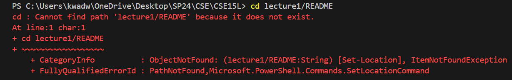
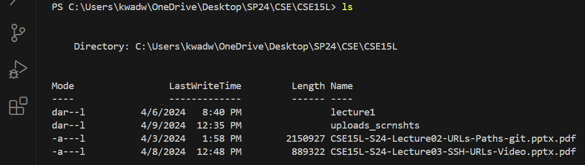

# **LAB REPORT 1**
## Command: `cd`
`cd with no argument`
\
\

\
_Absolute path before command_: `C:\Users\kwadw\OneDrive\Desktop\SP24\CSE\CSE15L`
\
_Output:_ A new line was created.
\
_Explanation_: This is **NOT AN ERROR** because the command `cd` is for changing the working directory and since I provided no argument, the working directory was not changed.
\
\
`cd with directory`
\
\

\
_Absolute path before command_: `C:\Users\kwadw\OneDrive\Desktop\SP24\CSE\CSE15L`
\
_Output:_ The working directory was changed to the given directory path.
\
_Explanation_: This is **NOT AN ERROR** because the command `cd` is for changing the working directory to the directory path given as an argument.
\
\
`cd with file`
\
\

\
_Absolute path before command_: `C:\Users\kwadw\OneDrive\Desktop\SP24\CSE\CSE15L`
\
_Output:_ An error message indicating no such path exists.
\
_Explanation_: This is **AN ERROR** because the command `cd` is for changing the working directory. A file is not a directory so that was to be expected.

## Command: `ls`
`ls with no argument`
\
\

\
_Absolute path before command_: `C:\Users\kwadw\OneDrive\Desktop\SP24\CSE\CSE15L`
\
_Output:_ A list of every file and folder in the working directory was printed on screen.
\
_Explanation_: This is **NOT AN ERROR** because the command `ls` is for listing every file and folder in a given directory. When no directory is provided, it assumes the current working directory.
\
\
`ls with directory`
\
\

\
_Absolute path before command_: `C:\Users\kwadw\OneDrive\Desktop\SP24\CSE\CSE15L`
\
_Output:_ A list of every file and folder in the directory given as an argument to the command.
\
_Explanation_: This is **NOT AN ERROR** because the command `ls` is for listing every file and folder in a given directory.
\
\
`ls with file`
\
\

\
_Absolute path before command_: `C:\Users\kwadw\OneDrive\Desktop\SP24\CSE\CSE15L`
\
_Output:_ The file which was given as an argument was listed.
\
_Explanation_: This is **NOT AN ERROR** because the given file did exist.

## Command: `cat`
`cat with no argument`
\
\

\
_Absolute path before command_: `C:\Users\kwadw\OneDrive\Desktop\SP24\CSE\CSE15L`
\
_Output:_ The system requested a path to get the content that was to be printed on the screen.
\
_Explanation_: This is **NOT AN ERROR** because the command `cat` is for printing the contents of a file to the screen.
\
\
`cat with directory`
\
\

\
_Absolute path before command_: `C:\Users\kwadw\OneDrive\Desktop\SP24\CSE\CSE15L`
\
_Output:_ An error message indicating access to the given path was denied.
\
_Explanation_: This is **AN ERROR** because the command `cat` is for printing the contents of a file to the screen. A directory is not a file with content to be read and printed.
\
\
`cat with file`
\
\

\
_Absolute path before command_: `C:\Users\kwadw\OneDrive\Desktop\SP24\CSE\CSE15L`
\
_Output:_ The contents of the file was printed on screen.
\
_Explanation_: This is **NOT AN ERROR** because the command `cat` is for printing the contents of a file to the screen.
