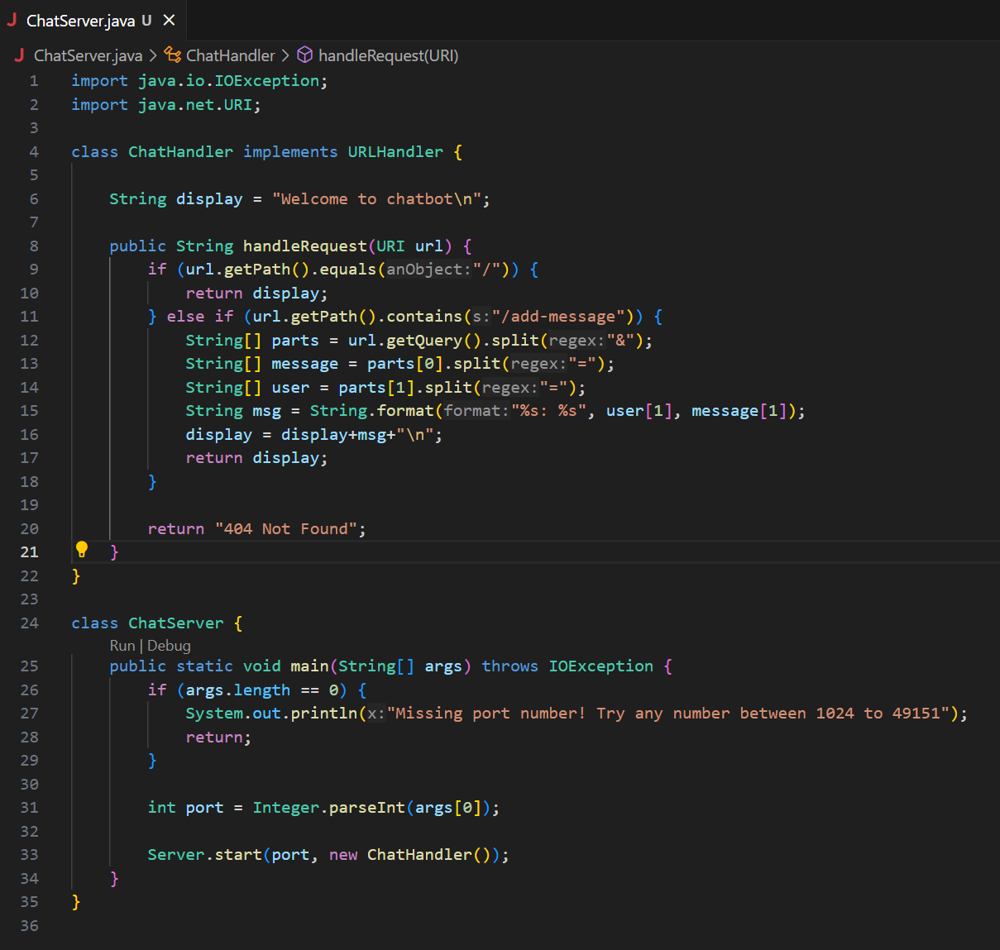
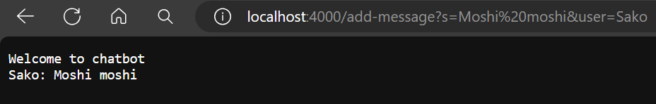
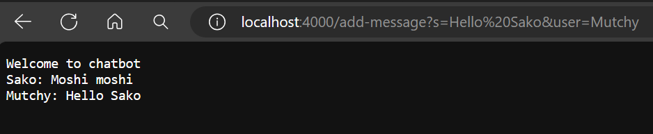
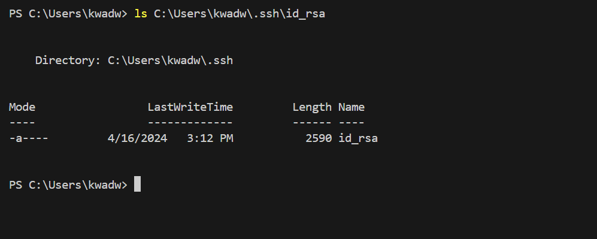
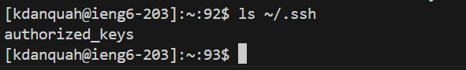
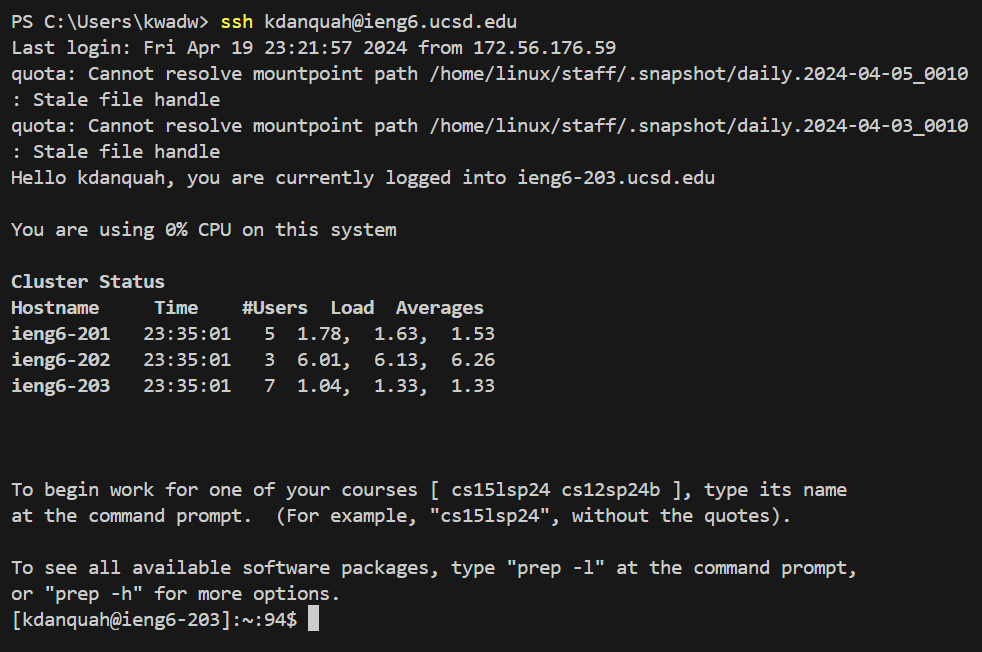

# **LAB REPORT 2**
# Part 1
## ChatServer.java
\

## add-message request
\

\
The ChatServer class calls the handleRequest method in ChatHandler with an URI instance called *url* that is then parsed to extract the `/add-message` request.

As can be seen in the image, *url* contains the message "Moshi moshi" by the user Sako.

The handleRequest method then appends the user and message to the display string which is returned to the browser.
\

\
The ChatServer class calls the handleRequest method in ChatHandler with an URI instance called *url*.

*url* contains the message "Hello Sako" by the user Mutchy.

The handleRequest method appends the user and message to the display string.
# Part 2
## private key on local
\

## public key on ieng6
\

## ssh to ieng6 without password
\

# Part 3
\
I previously thought that the information in an url was only descriptive. The labs in the past
two weeks have helped me realize that complex requests can be sent to a server through the url alone. I now notice most of
the different requests and parameters in urls.
