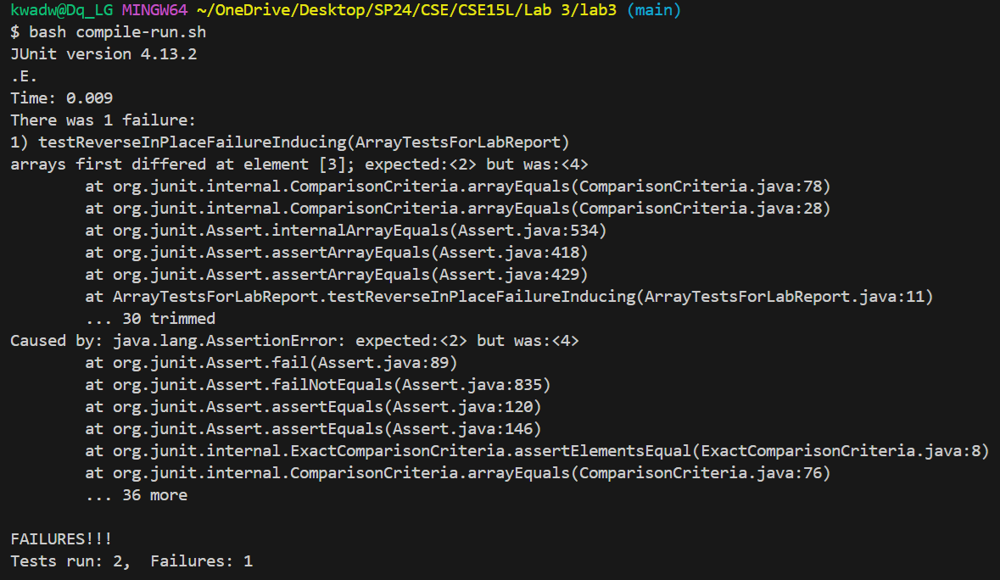

# **LAB REPORT 3**
# PART 1
## Bug: ArrayExamples.reverseInPlace()
## Failure-inducing input
```
import static org.junit.Assert.assertArrayEquals;
import static org.junit.Assert.assertEquals;
import org.junit.Test;

public class ArrayTestsForLabReport {
@Test
    public void testReverseInPlaceFailureInducing() {
        int[] input1 = { 1, 2, 3, 4, 5 };
        ArrayExamples.reverseInPlace(input1);
        assertArrayEquals(new int[] { 5, 4, 3, 2, 1 }, input1);
    }
.
.
.
}
```
## Passing input
```
import static org.junit.Assert.assertArrayEquals;
import static org.junit.Assert.assertEquals;
import org.junit.Test;

public class ArrayTestsForLabReport {
.
.
.
   @Test
    public void testReverseInPlacePass() {
        int[] input1 = { 1, 1, 2, 1, 1 };
        ArrayExamples.reverseInPlace(input1);
        assertArrayEquals(new int[] { 1, 1, 2, 1, 1 }, input1);
    }
}
```
## Symptom


## Buggy Code
```
  static void reverseInPlace(int[] arr) {
    for (int i = 0; i < arr.length; i += 1) {
      arr[i] = arr[arr.length - i - 1];
    }
  }
```

## Fixed code
```
  static void reverseInPlace(int[] arr) {
   int[] original = arr.clone();
    for (int i = 0; i < arr.length; i += 1) {
      arr[i] = original[arr.length - i - 1];
    }
  }
```
## Explanation of code fix
The bug in the original code was that the method was overwriting the data in the array too early. By cloning the orginal array, I kept the orginal data which could be placed in the array in reverse.

# PART 2
