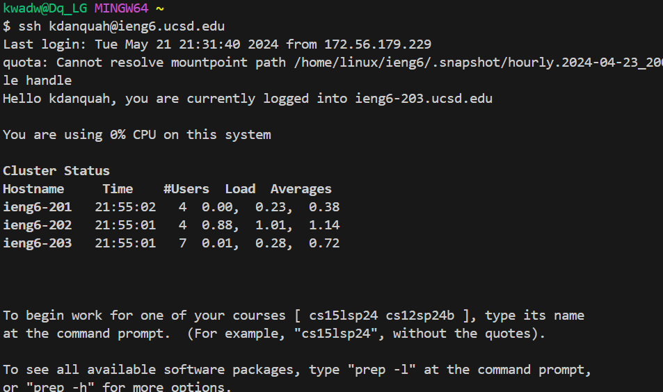
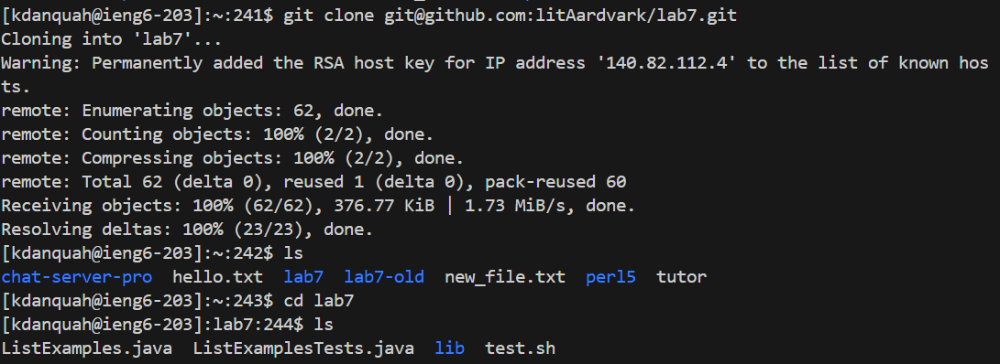
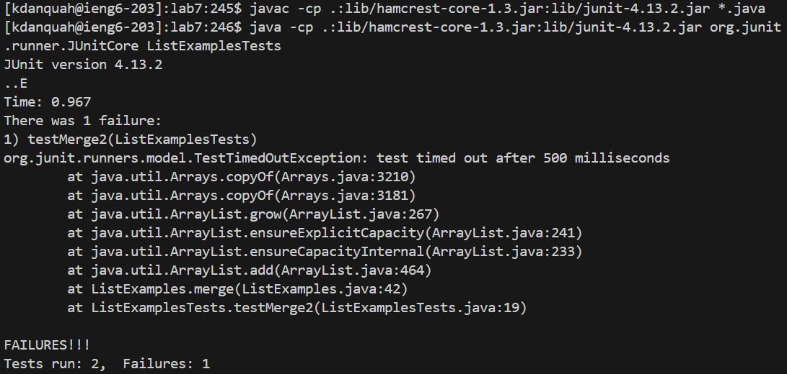
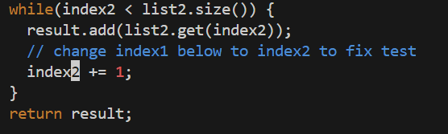
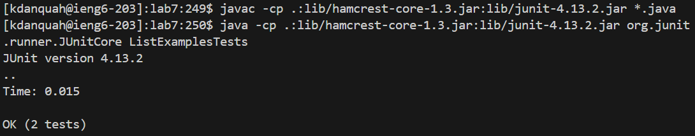
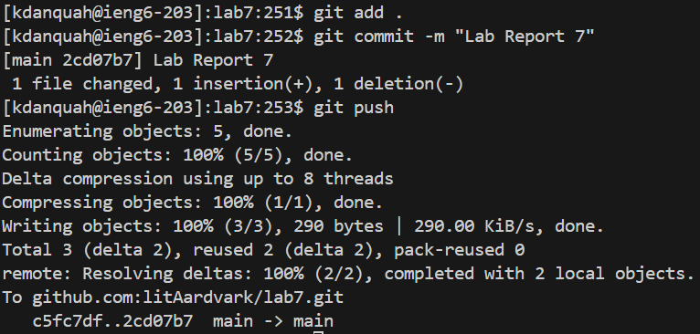

# **LAB REPORT 4**
## Log into _ieng6_

\
Keys pressed: `<up><enter>` The `ssh` command was 1 up in the command history so I accessed it and ran it that way.
The `ssh` command  connects me to the remote ieng6 computers.

## Clone fork

\
Keys pressed: `<up><up><up><enter>`, `ls<enter>`, `cd lab7<enter>`, then `ls<enter>`. The `git clone` command was 3 up in the command history. The `cd` command was to get me into the right working directory, and the `ls` was to orient myself.

## Run and Fail Tests

\
Keys pressed: `<up><up><up><up><up><up><enter>`, `<up><up><up><up><up><up><enter>` . The `javac -cp .:lib/hamcrest-core-1.3.jar:lib/junit-4.13.2.jar *.java` command was 6 up in the command history. And the `java -cp .:lib/hamcrest-core-1.3.jar:lib/junit-4.13.2.jar org.junit.runner.JUnitCore ListExamplesTests` command was 6 up in the command history. With these two commands I compiled all the relevant java files and ran the ListExamplesTests.

## Edit Code

\
Keys pressed: `vim ListExamples.java<enter>`, held `<down>` until cursor was on desired line, and `<right><right><right>` to highlight the `1` on `index1`, then `r 2` to replace the `1` with `2`, and finally `:wq` to save my edits and exit vim.

## Run and Pass Tests

\
Keys pressed: `<up><up><up><enter>`, `<up><up><up<enter>`. Both the `javac -cp .:lib/hamcrest-core-1.3.jar:lib/junit-4.13.2.jar *.java` and the `java -cp .:lib/hamcrest-core-1.3.jar:lib/junit-4.13.2.jar org.junit.runner.JUnitCore ListExamplesTests` command were 3 up in the command history. I used these commands to recompile my files and run the test again.

## Commit and Push Changes

\
Keys pressed: `git add .<enter>`, `git commit -m "Lab Report 7"<enter>`, `git push<enter>`. The `git add .` staged all the files in my working directory. `git commit -m` committed my files with the simple message "Lab Report 7", then `git push` pushed all my files back to my repository.

