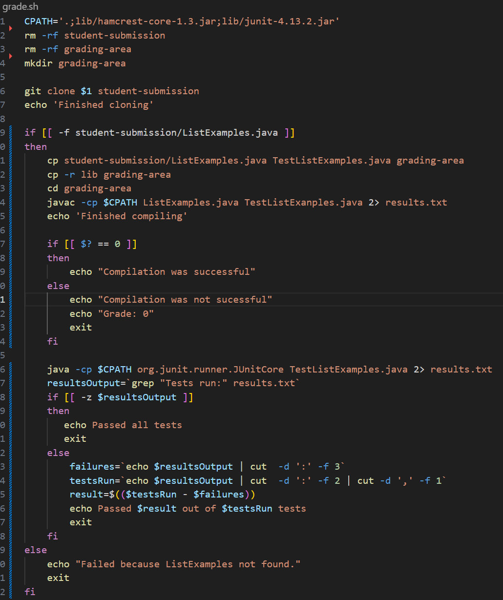

# **LAB REPORT 5**
## Original post from student

When I run my grader script on a student submission that has no bugs, it fails my tests. I have two tests in my TestListExamples.java that I know works because I used it to test my own ListExamples. Could the student submission be buggy? But I am using the repo that has the bugs corrected.

## TA response
Is there a way to see the exact output from compiling and running the files in your script?

## Follow up student post

## Part 2 - Reflection
I never realized how easy it was to quickly manipulate files straight from the terminal. Being able to create a script that compiles and runs a java program, capture the output of the program and use it elsewhere. The potential for automation from the terminal is almost limitless, and I am glad this class gave a good introduction to these concepts.

