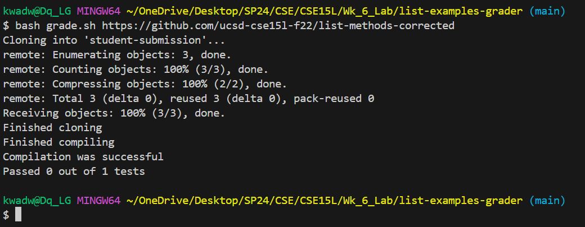

# **LAB REPORT 5**
## Original post from student

When I run my grader script on a student submission that has no bugs, it fails one test then exits. I have two tests in my TestListExamples.java but it only runs one test. I think it is running a different TestListExamples, maybe there is one in the student submission?

## TA response

## Follow up student post

## Part 2 - Reflection
I never realized how easy it was to quickly manipulate files straight from the terminal. Being able to create a script that compiles and runs a java program, capture the output of the program and use it elsewhere. The potential for automation from the terminal is almost limitless, and I am glad this class gave a good introduction to these concepts.

