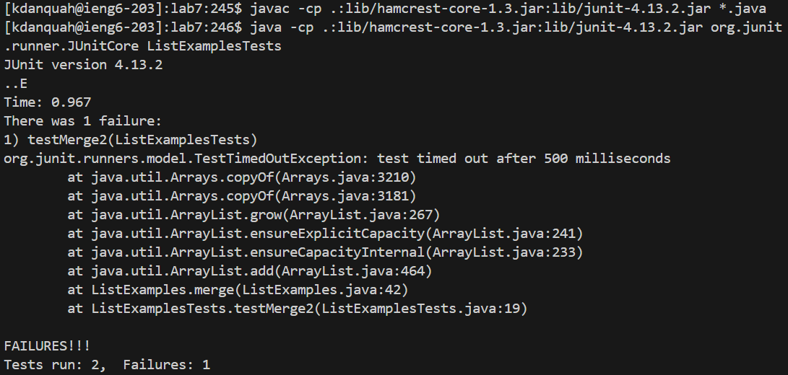

# **LAB REPORT 5**
## Original post from student

## TA response

## Follow up student post

## Part 2 - Reflection
I never realized how easy it was to quickly manipulate files straight from the terminal. Being able to create a script that compiles and runs a java program, capture the output of the program and use it elsewhere. The potential for automation from the terminal is almost limitless, and I am glad this class gave a good introduction to these concepts.

