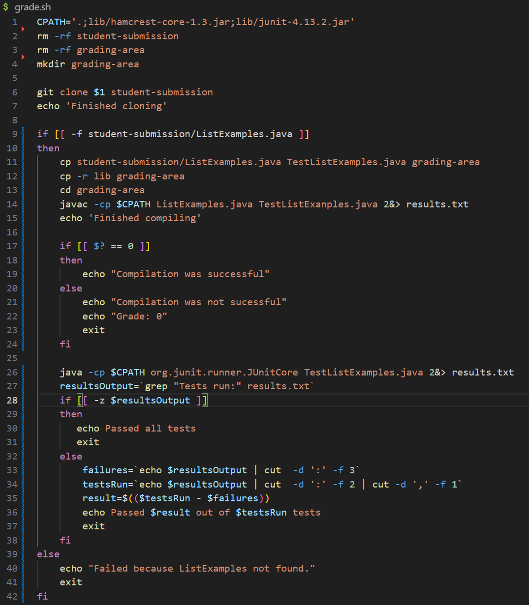

# **LAB REPORT 5**
## Original post from student

When I run my grader script on a student submission that has no bugs, it fails my tests. I have two tests in my TestListExamples.java that I know works because I used it to test my own ListExamples. Could the student submission be buggy? But I am using the repo that has the bugs corrected.

## TA response
Is there a way to see the exact output from compiling and running the files in your script?

## Follow up student post
I saved my compiling and running output in a file. Here is what it contains after another run of my script.

It looks like it can't find my TestListExamples class because I have it running TestListExamples.java in my script. The tests it's running are not my tests. I think I need to check my script a little closer.

## Setup information
Structure of working directory:\

Contents of grade.sh:\

Contents of TestListExamples:\

Command that triggers bug:\
`bash grade.sh https://github.com/ucsd-cse15l-f22/list-methods-corrected`\
Description of what to edit:\
There are a few bugs in the grading script. The fix for the first bug, the one seen in the symptom, is to replace `TestListExamples.java` on line 26 of grade.sh with `TestListExamples`. Another bug is there is a spelling mistake on line 14 so replace `TestListExanples.java` with `TestListExamples.java`. The `echo` command on line 15 should be inside the if-then statement on line 18, 19 because it will interfere with properly checking if a compilation was successful since it changes the exit code value of `$?`.

## Part 2 - Reflection
I never realized how easy it was to quickly manipulate files straight from the terminal. Being able to create a script that compiles and runs a java program, capture the output of the program and use it elsewhere. The potential for automation from the terminal is almost limitless, and I am glad this class gave a good introduction to these concepts.

